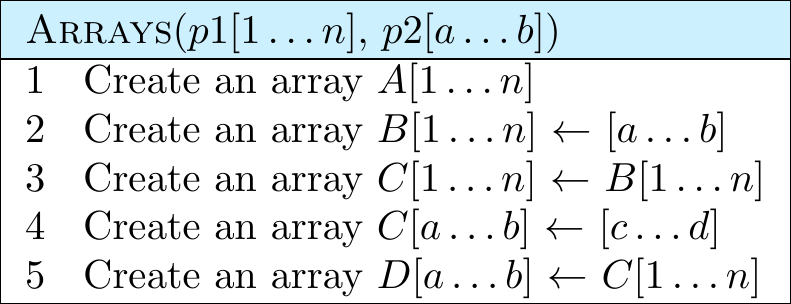
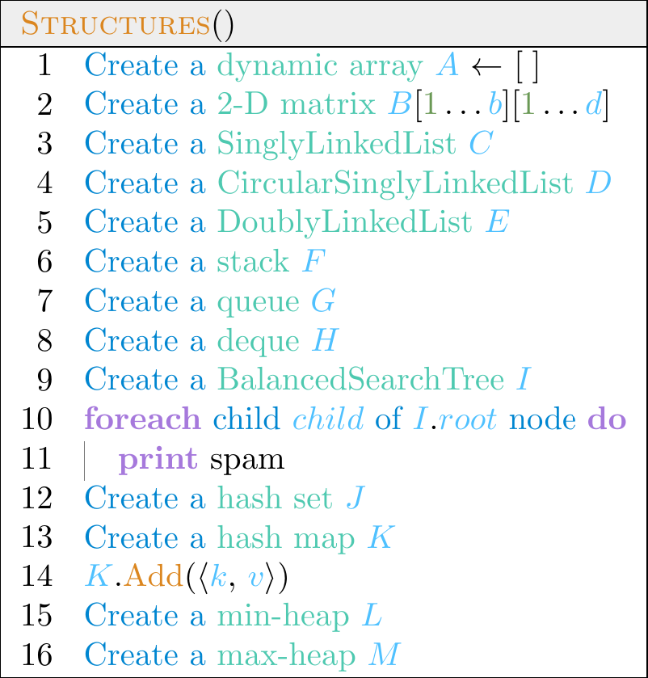

# Overview

A Python to $\LaTeX$ transpiler for those taking CSE214 with Prof. Ganapathi. May still require manual tweaking of the output on the user's end for certain edge cases, but gets the bulk of the job done.

# Array syntax

<!-- ```py
# ex1.py
def Arrays():
    A = Array((1, n))
    B = Array((1, n), (0, 0))
    C = Array((1, n), (1, n))
    D = Array((1, n), Array(B, (1, n)))
    Array(E, (1, n))  # equivalent to F
    F: Array((1, n))  # equivalent to E
``` -->
<table>
<tr>
<td>

```py
# ex1.py
def Arrays():
    A = Array((1, n))
    B = Array((1, n), (0, 0))
    C = Array((1, n), (1, n))
    D = Array((1, n), Array(B, (1, n)))
    Array(E, (1, n))  # equivalent to F
    F: Array((1, n))  # equivalent to E
```

 </td>
 <td>

 

 </td>
</tr>
</table>

```
converter.py ex1.py -o my_file.tex -t 0
```

# Other data structures syntax

<table>
<tr>
<td>

```py
# ex2.py
def Structures():
    A = List()
    B = Mat((1, b), (1, d))
    C = SLL()
    D = CSLL()
    E = DLL()
    F = Stack()
    G = Queue()
    H = Deque()
    I = BST()
    for child in I.root:
        print(r"spam")
    J = Set()
    K = Map()
    K.Add([k, v]) # lists for kv pairs
    L = MinHeap()
    M = MaxHeap()
```

 </td>
 <td>

 

 </td>
</tr>
</table>

```
converter.py ex2.py -o my_file.tex -t 1
```

# Example

<table>
<tr>
<td>

```py
# ex3.py
def Foo(a, b, MyArr: Array((1, n))):
    1 + 2 / 3 * 4 - 5 ** 6 // 7 % 8
    (1 + 2) / (3 * 4) - 5 ** 6 // (7 % 8)
    _ # force newlines
    while False:
        x, y = a, b
    _
    if 1 + 1 == 0:
        a.bar()
    elif not (MyArr[0] and (b.member or c)):
        Baz()
    else:
        return a // b if a else None
    _
    for i in range(1, 10):
        for j in range(5):
            continue
    for i in range(0, 10, 3):
        for j in range(10, 0, -1):
            for k in range(10, 0, -2):
                break
    _
    return Bar(Array(A, (1, n - 1)))
```

 </td>
 <td>

 

 </td>
</tr>
</table>

```
converter.py ex3.py -o my_file.tex -t 2
```